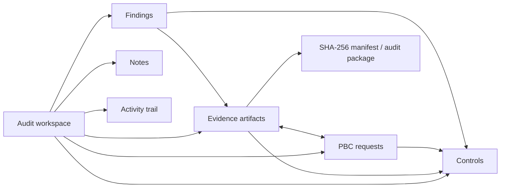

# Architecture

Audit Prep Tool is a local-first, single-user browser application. The source UI is a self-contained `index.html`; it contains the markup, styling, and application JavaScript. `launcher.go` embeds that UI and serves it only from `http://127.0.0.1:51327` for a stable browser-storage origin.

## State and relationships

State is held in one IndexedDB key-value store. A root state object holds app settings, the selected theme, and multiple isolated audit workspaces. A workspace contains artifacts, controls, PBC requests, findings, notes, chat entries, and activity records.

Artifacts store their mapped control IDs and PBC request IDs. PBC records store the reverse artifact IDs, and save/delete paths maintain that bidirectional relationship. Controls are referenced by artifacts, requests, and findings; deleting a control clears those references. Findings may reference evidence but do not own it, so deleting a finding preserves evidence.

## Evidence and exports

Image upload is browser-side. The app rejects non-images and images above 25 MB, reads accepted images into data URLs, calculates SHA-256 with Web Crypto, and rejects duplicates in the active workspace. Annotation and redaction create a new PNG artifact with a `versionOf` reference; the original remains intact.

The app can export a JSON backup, a CSV evidence manifest, activity CSV, a printable HTML report, and an uncompressed ZIP containing report, manifest, README, and evidence files. Browser downloads perform these exports; there is no server-side evidence store.

## Encryption

Optional storage encryption uses AES-GCM with a random IV per save. The key is derived from a user-supplied password using PBKDF2-SHA-256 with 250,000 iterations and a random salt. The password is not stored. This protects the app-managed IndexedDB state but does not replace endpoint or disk encryption.

## AI connectors

The optional AI layer supports Ollama (`/api/tags` and `/api/chat`) and OpenAI-compatible chat-completions endpoints. Workspace metadata is supplied as text context. Screenshot pixels are attached only after the user enables the vision option and selects an artifact. Connector calls occur directly in the browser and depend on the target service's CORS configuration.

## Desktop launcher

The Go launcher uses only the standard library. It embeds `index.html`, binds the loopback-only listener, exposes `GET /__health`, opens the default browser, and detects an already-running local instance. Packaged executables are release artifacts and intentionally excluded from normal Git history; rebuild them from the checked-in source as described in the README and release process.
